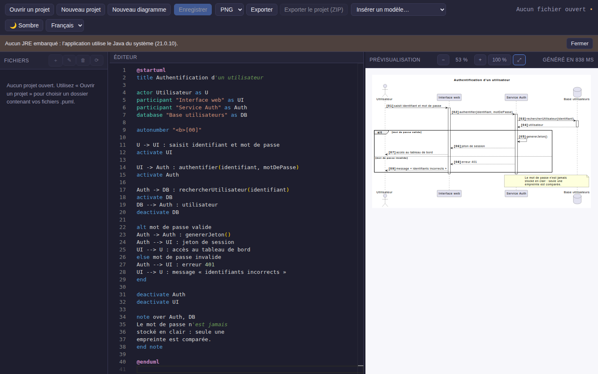

# PlantUML Studio

Application desktop **100 % hors ligne** pour créer des diagrammes UML avec PlantUML.
Electron + React + TypeScript, moteur `plantuml.jar` exécuté localement.



## Fonctionnalités

- **Assistant de création** : un formulaire par type de diagramme — acteurs, classes, messages,
  relations — dont l'application écrit la source PlantUML. Les 14 types UML sont couverts, plus
  le Gantt ; aucune syntaxe à connaître, et l'aperçu de la source se met à jour à chaque frappe.
  Le diagramme de cas d'utilisation se saisit **par acteur** : son rôle, de qui il hérite, et
  tout ce qu'il fait
- **Règle d'héritage appliquée** : un cas ne reçoit jamais deux flèches d'acteurs qui
  s'héritent — la généralisation les donne déjà. L'assistant ne l'écrit pas, et les diagrammes
  déjà écrits sont vérifiés : la flèche de trop est signalée avec sa ligne, puis **« Corriger »
  les retire toutes d'un clic**, en laissant à leur place un commentaire qui dit ce qui a été
  enlevé et pourquoi. La correction passe par l'éditeur, donc Ctrl+Z la défait
- **Dérivation depuis les cas d'utilisation** : à partir d'un diagramme de cas d'utilisation —
  écrit à la main, collé ou produit par l'assistant — l'application tire un diagramme de
  séquence et un diagramme de communication **par cas**, le diagramme de classes d'analyse et la
  vue d'ensemble des interactions. Ce qui ne se dérive pas est listé avec sa raison
- Éditeur Monaco avec coloration syntaxique PlantUML, autocomplétion et extraits de code
- Prévisualisation SVG en temps réel (rendu débouncé, zoom et déplacement à la souris)
- Panneau d'erreurs **en français**, avec numéro de ligne cliquable qui positionne le curseur
- Arborescence de projet : création, renommage, suppression de fichiers `.puml`
- Édition libre avant enregistrement : un diagramme se compose dans l'éditeur, puis
  **« Enregistrer sous… »** (Ctrl+Maj+S) demande sa destination — aucun projet requis
- **Édition du rendu** : déplacer à la souris n'importe quel élément de l'aperçu — y compris un
  paquetage, qui **emmène tout ce qu'il contient** — pendant que les flèches sont recalculées et
  déviées pour ne traverser ni un élément ni une autre flèche ; la source reste intacte et
  l'export conserve les déplacements
- **Disposition imposée aux cas d'utilisation** : acteurs principaux en colonne à gauche,
  acteurs secondaires — services externes, dessinés en rectangles — en colonne à droite. Le sens
  d'écriture des associations décide du côté, et « Optimiser » range les colonnes puis les fige
- **Optimisation de la disposition** : le bouton « Optimiser » évalue la géométrie réellement
  dessinée — croisements, flèches qui se frôlent, éléments traversés — et cherche par
  déplacements successifs une disposition plus lisible. Mesuré sur 17 diagrammes : **11 défauts
  ramenés à 2**, en 206 ms cumulées, sans jamais dégrader un diagramme déjà propre
- Export PNG / SVG / PDF d'un diagramme, ou du projet entier en archive ZIP
- **Les 14 diagrammes UML 2.5**, chacun livré comme modèle commenté en français, suivant un
  formalisme documenté ([`docs/formalisme.md`](docs/formalisme.md))
- **Diagramme de Gantt** — le formulaire s'ouvre avec les **huit phases d'un projet de fin
  d'études déjà nommées** ; il ne reste qu'à renseigner les périodes. Chaque phase se borne par
  deux dates plutôt que par une durée, ce qui laisse deux phases **se chevaucher** — la
  rédaction du rapport court en parallèle de la réalisation — chacune recevant **sa propre
  couleur**, sans rien à saisir. Jalons, avancement et jours non travaillés en option. **Le
  Gantt n'est pas un diagramme UML** — il ne figure pas dans la norme 2.5 — et il est rangé
  dans sa propre famille, « Planification (hors UML) »
  ([`docs/gantt.md`](docs/gantt.md))
- Formalisme **appliqué automatiquement à toute source**, y compris écrite à la main : aucune
  ligne de `skinparam` à recopier, et une bascule pour revenir au rendu PlantUML par défaut
- Thème clair / sombre, interface en français et en anglais
- Aucune connexion réseau : garantie vérifiée par un scan statique et par le blocage des requêtes sortantes au runtime

## Prérequis

| Composant | Nécessaire ? | Détail |
| --- | --- | --- |
| Node.js ≥ 20.19 | développement uniquement | build Vite et Electron |
| Java 11+ | oui, à l'exécution | recherché dans cet ordre : JRE embarqué (`resources/jre/`), `JAVA_HOME`, puis le `PATH` |
| `plantuml.jar` | oui | `npm run resources:plantuml` |
| Graphviz | non, mais recommandé | sans lui, le moteur **Smetana** intégré prend le relais et ignore les tracés orthogonaux |

## Installation (développement)

```bash
npm install
npm run resources:plantuml          # télécharge plantuml.jar dans resources/
npm run resources:jre               # optionnel : JRE embarqué pour la plateforme courante
npm run dev                         # Vite + tsc --watch + Electron
```

`npm run dev` démarre trois processus en parallèle : le serveur Vite (port 5173), la
compilation TypeScript du main/preload en mode watch, puis Electron dès que les deux
sont prêts.

## Scripts

```bash
npm run build            # compile main + preload (tsc) et renderer (Vite) dans dist/
npm run typecheck        # vérifie les trois configurations TypeScript
npm test                 # tests unitaires (Vitest)
npm run test:e2e         # tests de bout en bout (Playwright + Electron, après npm run build)
npm run verify:offline   # échoue si un appel réseau apparaît dans src/
npm run package:win      # installateur NSIS (.exe)
npm run package:mac      # image disque (.dmg)
npm run package:linux    # paquets .deb, .rpm et AppImage
```

## Poids des artefacts

Mesuré sur un build réel (Linux, `.deb`, sans JRE embarqué) :

| Élément | Taille |
| --- | --- |
| Paquet `.deb` complet | 120 Mo |
| dont `plantuml.jar` | 21,5 Mo |
| `app.asar` (code applicatif) | 18 Mo |
| JRE Temurin embarqué, si ajouté | ≈ 35 Mo compressés |

Les paquets utilisés uniquement par le renderer (Monaco, React, Zustand) sont en
`devDependencies` : Vite les intègre déjà à `dist/renderer`, les conserver en
dépendances d'exécution ajoutait **107 Mo** de code mort dans l'archive.

## Architecture

```
┌──────────────────────────────────────────────────────────────┐
│                    MAIN PROCESS (Node.js)                     │
│  BrowserWindow · handlers IPC · PlantUMLService (java -jar)    │
│  FileService · ProjectService · ExportService                  │
│  EnvironmentService (Java / Graphviz) · TemplateService        │
└───────────────────────────┬──────────────────────────────────┘
                            │ contextBridge (preload sandboxé)
┌───────────────────────────▼──────────────────────────────────┐
│                    RENDERER PROCESS (React)                   │
│  ThreePanelLayout : FileTree · Monaco · DiagramPreview         │
│  Zustand (projet, éditeur, préférences, notifications)         │
└──────────────────────────────────────────────────────────────┘
```

### Flux de rendu

1. L'utilisateur tape dans Monaco ; `useDebouncedRender` attend 400 ms (réglable).
2. Le renderer appelle `window.electronAPI.renderDiagram(source, 'svg')`.
3. `PlantUMLService` lance `java -jar plantuml.jar -tsvg -pipe -failfast2` et écrit la
   source sur `stdin` — **aucun fichier temporaire** n'est créé pour la prévisualisation.
4. Le SVG revient par `stdout`, il est assaini (`sanitizeSvg`) puis injecté dans le DOM.
5. En cas d'échec, `stderr` est analysé : le numéro de ligne renvoyé par PlantUML est
   relatif au `@startuml` et se voit converti en numéro de ligne du fichier, ce qui rend
   le lien du panneau d'erreurs fiable même lorsque la source commence par des commentaires.

### Choix techniques notables

- **Mode `-pipe`** plutôt que des fichiers temporaires : plus rapide et sans nettoyage à gérer.
- **`-failfast2`** : sans cette option, une erreur de syntaxe produit une image d'erreur avec
  un code de sortie `0`, impossible à distinguer d'un succès.
- **Repli Smetana** (`-Playout=smetana`) quand aucun binaire `dot` n'est trouvé : l'application
  reste utilisable sans Graphviz installé.
- **Profil de sécurité PlantUML** : `SANDBOX` par défaut (aucun accès disque ni réseau depuis
  le moteur) ; dès qu'un projet est ouvert, on bascule sur `ALLOWLIST` limité à son dossier,
  ce qui autorise `!include ./fichier.puml` sans rouvrir la porte au réseau.
- **Preload sandboxé** : un preload en bac à sable ne peut pas faire de `require` relatif ; les
  noms de canaux y sont donc recopiés, et `tests/unit/PreloadApi.test.ts` garde les deux listes
  synchronisées.
- **Monaco importé via `monaco-editor/editor/editor.api`** : le point d'entrée complet
  embarquerait les workers CSS/HTML/JSON/TypeScript, soit ~9 Mo inutiles ici.

## Sécurité et garantie « hors ligne »

Quatre barrières indépendantes :

1. **Scan statique** — `npm run verify:offline` refuse `fetch`, `XMLHttpRequest`, `WebSocket`,
   `axios`, les modules `http`/`https`/`net`/`tls`/`dns` et les URL distantes dans `src/`.
   Les scripts de build (`scripts/`) en sont exclus : eux ont besoin du réseau.
2. **Blocage runtime** — `session.defaultSession.webRequest.onBeforeRequest` annule toute
   requête sortante ; seuls `file:`, `blob:`, `data:`, `devtools:` et le serveur Vite local
   (en développement) passent.
3. **Content-Security-Policy stricte** — `default-src 'none'` dans `index.html`, sans
   `unsafe-eval`, ni source distante.
4. **Cloisonnement Electron** — `contextIsolation: true`, `nodeIntegration: false`,
   `sandbox: true`, navigation et ouverture de fenêtres bloquées.

S'y ajoute le confinement des accès disque : toute opération fichier demandée par le renderer
est refusée si elle sort du dossier du projet ouvert (`FileService.isWithin`).

## Structure du projet

```
docs/formalisme.md  référence du formalisme appliqué aux 14 diagrammes
docs/gantt.md       diagramme de Gantt : formulaire, syntaxe produite, limites
src/
  main/          processus principal (services, IPC, fenêtre, logger)
  preload/       pont contextBridge (sandboxé, sans import relatif)
  renderer/      application React (composants, stores Zustand, hooks, i18n, styles)
  shared/        types et constantes communs — sans dépendance Electron ni Node
templates/       14 modèles UML + le Gantt (+ _formalisme.puml, réglages communs)
resources/       plantuml.jar, jre/, graphviz/ (non versionnés — voir resources/README.md)
scripts/         téléchargement des ressources et vérification hors ligne
tests/unit/      Vitest — services du main process
tests/e2e/       Playwright — application Electron complète
```

## Tests

```bash
npm test                 # tests unitaires ; le rendu réel des modèles livrés n’est joué
                         # que si resources/plantuml.jar est présent
npm run build && npm run test:e2e
```

Les tests de bout en bout se désactivent d'eux-mêmes si `dist/` ou `resources/plantuml.jar`
sont absents, afin de ne pas transformer une ressource manquante en échec de suite.

## Mises à jour hors ligne

Aucune mise à jour automatique : elle supposerait un accès réseau. La diffusion se fait par
installateur transmis hors ligne (clé USB, partage local). `scripts/download-plantuml.js`
affiche l'empreinte SHA-256 du JAR téléchargé ; conservez-la pour vérifier l'intégrité d'un
paquet transmis par un canal non fiable.

## Licences des composants tiers

- PlantUML : LGPL / GPL / MIT selon la distribution retenue
- Eclipse Temurin (JRE) : GPLv2 with Classpath Exception
- Graphviz : Eclipse Public License 1.0
- Monaco Editor, React, Electron : MIT

Vérifiez ces conditions avant toute redistribution commerciale.

## Licence

MIT (voir `package.json`).
