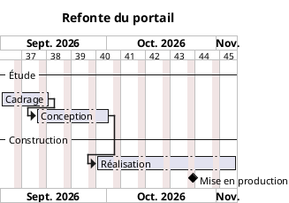

# Diagramme de Gantt

Le Gantt planifie des tâches dans le temps : combien de temps elles durent, dans quel ordre
elles s'enchaînent, où se posent les jalons.

## Ce n'est pas un diagramme UML

Il ne figure pas parmi les quatorze de la norme 2.5. PlantUML sait le produire, avec une
syntaxe qui lui est propre, et c'est à ce titre qu'il est proposé ici — dans sa propre
famille, **« Planification (hors UML) »**, pour ne pas laisser croire qu'il complète la norme.

Deux conséquences pratiques :

- l'encadrement est `@startgantt` / `@endgantt`, et non `@startuml` ;
- le formalisme commun ne s'applique qu'en partie : un Gantt n'a ni « élément » ni « flèche »
  à colorer. Seules la police et le fond sont repris ; la couleur d'une tâche se donne au cas
  par cas avec `is colored in`.

## Le formulaire

Quatre sections, dans l'assistant :

| Section | Ce qu'on y met |
| --- | --- |
| **Projet** | Le nom, la date de début (AAAA-MM-JJ) et l'échelle de l'axe : jours, semaines ou mois |
| **Tâches** | Une par ligne : nom, phase, durée en jours, la tâche après laquelle elle démarre, l'avancement |
| **Jalons** | Un point de contrôle sans durée, posé à la fin d'une tâche |
| **Jours non travaillés** | « samedi », « dimanche », ou une date précise |

La **phase** regroupe les tâches sous un intertitre. L'intertitre n'est écrit qu'au
changement de phase : répéter la même valeur sur plusieurs lignes ne découpe pas le
diagramme, il les rassemble.

Le champ **« Commence après »** est ce qui construit le planning. Laissé vide, la tâche démarre
au premier jour du projet ; renseigné, elle est enchaînée à la fin de celle qu'on désigne, et
tout décalage se propage.

## Le français saisi, l'anglais écrit

La syntaxe Gantt de PlantUML est en anglais. Le formulaire reste en français et la traduction
se fait à la génération :

| Ce que vous saisissez | Ce que la source porte |
| --- | --- |
| Durée : `10` | `[Cadrage] lasts 10 days` |
| Commence après : `Cadrage` | `[Conception] starts at [Cadrage]'s end` |
| Avancement : `40` | `[Conception] is 40% completed` |
| Jalon à la fin de `Recette` | `[Mise en production] happens at [Recette]'s end` |
| Jour non travaillé : `samedi` | `saturday are closed` |
| Jour non travaillé : `2026-12-25` | `2026-12-25 is closed` |

`language fr` est écrit en tête : les mois et les jours affichés sur l'axe sont en français
(« Sept. 2026 », « Oct. 2026 »), alors même que les mots-clefs restent anglais.

## Saisies tolérées

Le formulaire ne renvoie pas d'erreur sur une saisie approximative — il en tire ce qu'il peut :

- une durée écrite « 12 jours » donne `lasts 12 days` : le premier nombre est retenu ;
- un avancement de « 250 » est ramené à 100, un avancement nul n'est pas écrit du tout ;
- les crochets d'un nom de tâche sont neutralisés — ils fermeraient la référence au milieu et
  casseraient toutes les lignes qui la citent ;
- une tâche ne peut pas s'enchaîner à elle-même, même si la liste la propose ;
- un jour non travaillé qui n'est ni un jour de la semaine ni une date **n'est pas écrit** :
  mieux vaut l'omettre qu'émettre une ligne que le moteur refusera.

## Exemple

Le modèle livré, [`templates/15-diagramme-gantt.puml`](../templates/15-diagramme-gantt.puml),
est commenté ligne à ligne et se rend tel quel.

