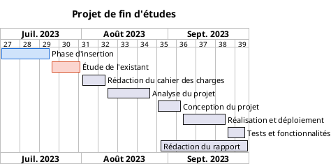

# Diagramme de Gantt

Le Gantt planifie des tâches dans le temps : combien de temps elles durent, dans quel ordre
elles s'enchaînent, où se posent les jalons.

## Ce n'est pas un diagramme UML

Il ne figure pas parmi les quatorze de la norme 2.5. PlantUML sait le produire, avec une
syntaxe qui lui est propre, et c'est à ce titre qu'il est proposé ici — dans sa propre
famille, **« Planification (hors UML) »**, pour ne pas laisser croire qu'il complète la norme.

Deux conséquences pratiques :

- l'encadrement est `@startgantt` / `@endgantt`, et non `@startuml` ;
- le formalisme commun ne s'applique qu'en partie : un Gantt n'a ni « élément » ni « flèche »
  à colorer. Seules la police et le fond sont repris ; la couleur d'une tâche se donne au cas
  par cas — et l'assistant le fait pour vous, une teinte par phase.

## Le formulaire

Quatre sections, dans l'assistant :

| Section | Ce qu'on y met |
| --- | --- |
| **Projet** | Le nom, l'échelle de l'axe — jours, semaines ou mois — et, si l'on veut, la date d'origine |
| **Phases** | Une par ligne : son intitulé, son début, sa fin, et l'avancement s'il y a lieu. La couleur est attribuée automatiquement |
| **Jalons** | Un point de contrôle sans durée, posé à la fin d'une phase |
| **Jours non travaillés** | « samedi », « dimanche », ou une date précise |

### Les phases sont déjà là

La section **Phases** s'ouvre pré-remplie avec les étapes usuelles d'un projet de fin
d'études, dans leur ordre habituel :

1. Phase d'insertion
2. Étude de l'existant
3. Rédaction du cahier des charges
4. Analyse du projet
5. Conception du projet
6. Réalisation et déploiement
7. Tests et fonctionnalités
8. Rédaction du rapport

Il ne reste qu'à remplacer les périodes d'exemple par les siennes. Les intitulés se modifient
comme n'importe quel champ, et des lignes s'ajoutent ou se retirent.

### Une période, pas une durée

Chaque phase se borne par **deux dates** plutôt que par une durée et un enchaînement. C'est ce
qui permet à deux phases de **se chevaucher** — la rédaction du rapport court le plus souvent
en parallèle de la réalisation et des tests, et aucun enchaînement ne saurait l'exprimer.

La **date de début du projet** est facultative : laissée vide, elle est prise sur la phase la
plus précoce. Elle n'est pas décorative pour autant — sans elle, PlantUML refuse toute phase
datée (« No starting date for the project ») —, mais vous n'avez pas à y penser.

### Une couleur par phase

Chaque phase reçoit sa propre teinte, dans l'ordre de la liste — il n'y a **rien à saisir**.
Sur un planning où les barres se chevauchent, c'est la couleur qui permet de suivre une phase
des yeux d'un bout à l'autre de l'axe.

La palette compte huit couples fond / bordure ; au-delà de huit phases elle est reprise depuis
le début, ce qui reste préférable à des teintes calculées au hasard. Pour imposer une couleur
précise, on modifie la ligne `is colored in` dans l'éditeur après génération.

## Le français saisi, l'anglais écrit

La syntaxe Gantt de PlantUML est en anglais. Le formulaire reste en français et la traduction
se fait à la génération :

| Ce que vous saisissez | Ce que la source porte |
| --- | --- |
| Début `2023-08-10`, fin `2023-08-25` | `[Analyse du projet] starts 2023-08-10 and ends 2023-08-25` |
| *(automatique)* | `[Analyse du projet] is colored in #CFE3FB/#1E6FD9` |
| Avancement : `40` | `[Analyse du projet] is 40% completed` |
| Jalon à la fin de `Rédaction du rapport` | `[Soutenance] happens at [Rédaction du rapport]'s end` |
| Jour non travaillé : `samedi` | `saturday are closed` |
| Jour non travaillé : `2023-08-15` | `2023-08-15 is closed` |

`language fr` est écrit en tête : les mois et les jours affichés sur l'axe sont en français
(« Sept. 2026 », « Oct. 2026 »), alors même que les mots-clefs restent anglais.

## Saisies tolérées

Le formulaire ne renvoie pas d'erreur sur une saisie approximative — il en tire ce qu'il peut :

- deux dates inversées sont remises dans l'ordre : l'intention se lit sans peine, et PlantUML
  les refuserait ;
- une phase dont la période est incomplète ou mal formée (`10/08/2023`) **n'est pas écrite** :
  mieux vaut l'omettre que faire échouer tout le diagramme sur une saisie en cours de frappe ;
- un avancement de « 250 » est ramené à 100, un avancement nul n'est pas écrit du tout ;
- les crochets d'un nom de phase sont neutralisés — ils fermeraient la référence au milieu et
  casseraient toutes les lignes qui la citent ;
- un jour non travaillé qui n'est ni un jour de la semaine ni une date n'est pas écrit non
  plus.

## Un écart avec un outil de planification dédié

Le rendu reprend la structure d'un Gantt classique — axe calendaire, une barre colorée par
phase, chevauchements visibles — avec une limite : **il n'y a pas de tableau à gauche.** Les
intitulés sont écrits sur les barres, sans colonnes « Début » / « Fin » en vis-à-vis du
graphique. C'est une limite du moteur, pas un réglage.

## Exemple

Le modèle livré, [`templates/15-diagramme-gantt.puml`](../templates/15-diagramme-gantt.puml),
est commenté ligne à ligne et se rend tel quel.

